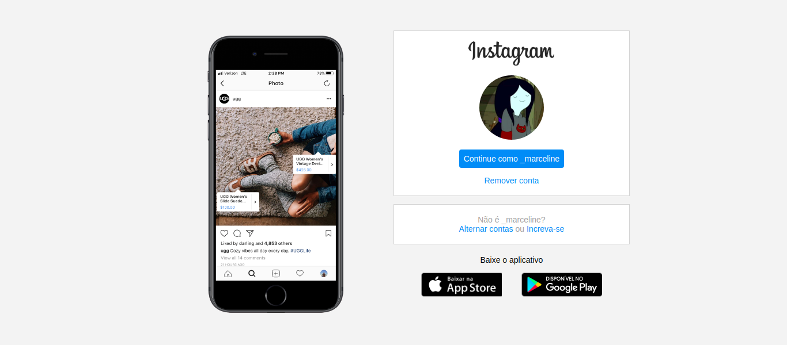

<h1 align="center">
 
    
 
 
INSTAGRAM
</h1>

Landing page from instagram in a desktop and mobile version. To improve the project was designed and added a switch button that changes the color theme from the application (light and dark mode).

    
    
    
    
    

## Features

This project is a reproduction from instagram landing page

- **JavaScript**
- **HTML**
- **CSS**

## Getting started

### You can use or modify this project yoursel following typing this code in your terminal: $ git clone https://github.com/vallegabrielle/instagram_landing_page.git